# CROssBAR-LLM

Welcome to the CROssBAR-LLM Interface. This system offers a natural language question-answering interface powered by large language models (LLMs) to enhance accessibility for researchers without programming expertise. It allows users to interact directly with the CROssBARv2 knowledge graph (KG) using natural language.

At its core, the interface translates natural language questions into structured Cypher queries, which are executed on the Neo4j graph database that stores CROssBARv2 KG. The structured results are then converted back into coherent, contextual responses by LLMs.

By design, CROssBAR-LLM is a conversational system. This feature allows the interface to maintain a short-term memory of your current session, enabling it to remember context from your previous queries. Thanks to this feature, you can ask follow-up questions or request further details about earlier conversation turns without needing to restate the entire context (though keep in mind that this memory has limitations :smiling_face_with_tear:).

> ⚠️ **Important Scope Note**
> CROssBAR-LLM is **not a general-purpose question answering system**. It is specifically designed for question answering **within the CROssBARv2 KG**. Because its intelligence is grounded in this specific KG, it may not fully answer general biological questions or questions about entities and relationships that are not present in the KG.
>
> The system is most useful for exploring **complex and multi-hop relationships** between biomedical entities, investigating potential biological mechanisms and hidden associations, and discover biologically meaningful connections that would otherwise require complex manual querying.

# CROssBAR Chat 

This module allows users to directly query and navigate the KG using natural language. You can open this module by clicking the **CROssBAR Chat** icon in the upper-left navigation menu or the **Start Querying** button on the Home page.

| Sidebar Navigation | Home Page Entry Point |
| :---: | :---: |
| 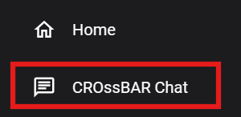 | 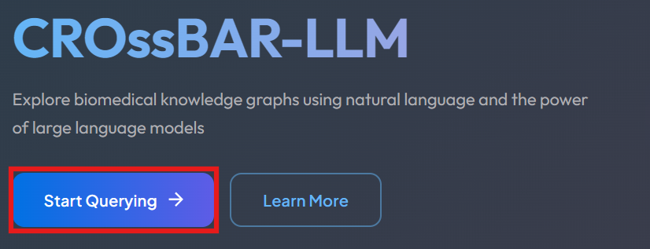 |

## Model Configuration

Before you begin querying, you must configure your LLM preferences in the *Options & Details* panel.

By clicking the **Model Settings** dropdown on the right side of the interface, you can customize the following parameters:
- **Provider & Model**: Select your preferred AI provider and the specific LLM model you wish to use from the provided lists. We provide free access to **gpt-5-mini (OpenAI)** and **gemini-3-flash (Google)** with rate limits. To use any other model, you must provide your own API key.
- **API Key**: Enter your valid API key to authenticate and enable the connection to the selected model.
- **Top K Results**: Define the number of results you want the system to return (adjustable between 1 and 100).
- **Debug Mode**: Toggle this switch to enable or disable detailed system logs for troubleshooting.

 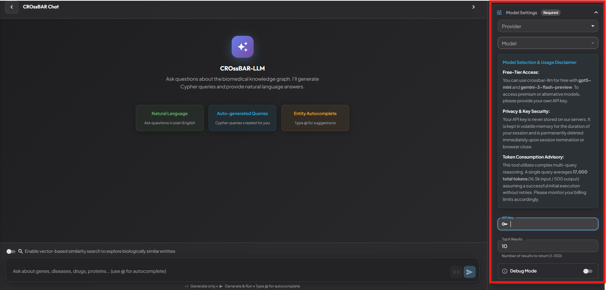

## Formulating Queries
You can quickly get started by selecting one of the predefined example questions from the **Example Queries** dropdown. Choosing an example will automatically populate the query input field so you can run it or modify it as needed.

 

You can type your question in the *query input field*. Instead of typing names manually, **the preferred method** is to use the autocomplete feature to quickly find relevant biological entities from the KG and avoid naming ambiguity. Press `@` and enter at least three characters to trigger autosuggestions. A dropdown list will appear, allowing you to navigate the suggestions using the arrow keys and select the entities you want to include in your query. This feature is particularly important for resolving cases where the same name exists under different node types; for example, `Hodgkin lymphoma` exists as both a *Phenotype* and a *Disease* in our KG, and autocomplete allows you to choose the correct one.

 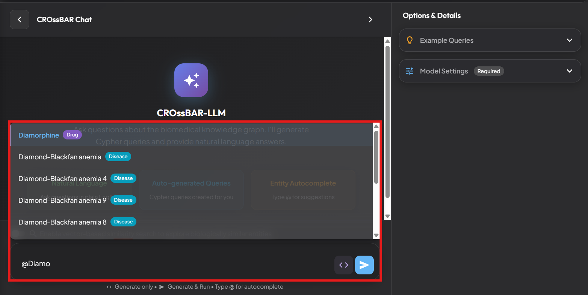 

Once you have formulated your question in the *query input field*, you have two primary options for execution located on the right side of the bar:
- **Generate Only (`<>`)**: Clicking the code icon will generate the Cypher query text for your natural language question without running it against the database. This is useful if you want to inspect or manually edit the Cypher statement before execution.
- **Generate & Run (`>`)**: Clicking the send icon will both generate the Cypher query and runs it directly on the graph database.

 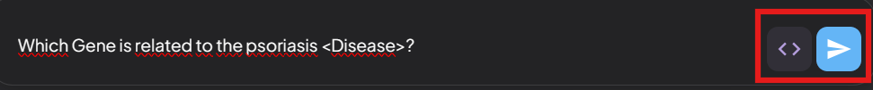 

## Viewing Results
Once you complete the required configuration, enter your question and click the **Generate & Run** button. The system will execute the query and display the corresponding natural language answer directly below your question.

 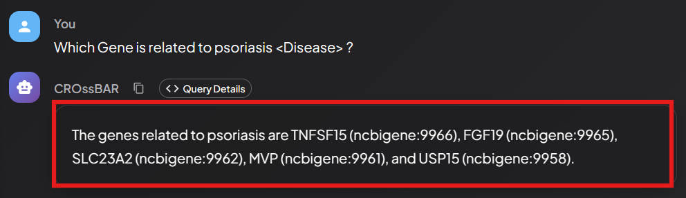 

Alternatively, you can click the **Generate Only** button. This allows you to **inspect and edit generated query** on the right side of interface before executing it. After making your adjustments, you can execute the refined query by clicking the **Run Query** button to receive your final results.

 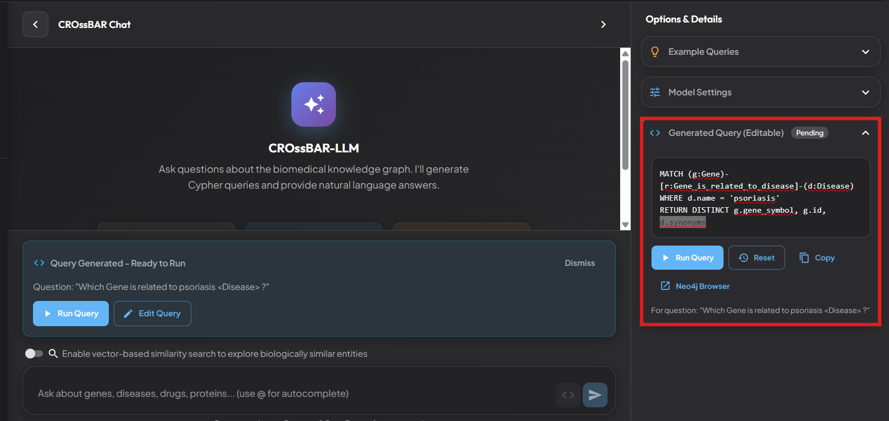 

On the right side of the interface, you can view the generated Cypher query for your question. Click the **Copy** button to copy the query, then open the [Neo4j Browser](https://neo4j.crossbarv2.hubiodatalab.com/browser/?preselectAuthMethod=[NO_AUTH]&dbms=bolt://neo4j.crossbarv2.hubiodatalab.com) and paste the query to visualize the results as a graph. Alternatively, you can click the **Neo4j Browser** button to open the browser directly and paste your copied query there.

> ⚠️ Important Note on Visualization
Not all Cypher queries can be rendered as a graph structure. Cypher queries that return only node or edge properties cannot be visualized as a graph in Neo4j Browser. Only queries that return nodes or paths can be visualized.

 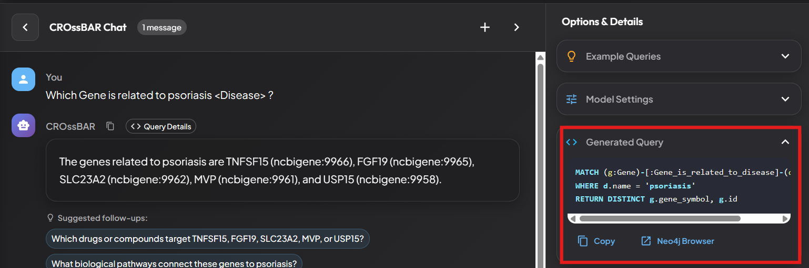 

When a query returns specific node identifiers, a detailed **Node Information** panel appears in the right-hand sidebar. This panel displays the entity categories, counts, names, identifiers, and their corresponding source databases.

 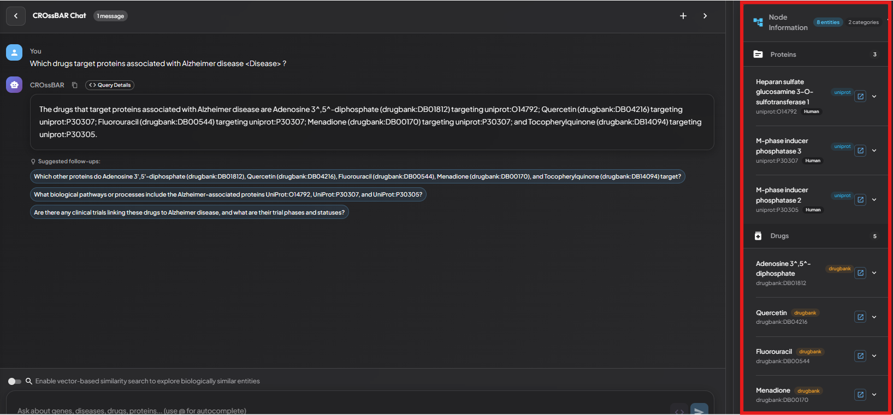 

For a deeper dive into specific results, you can access comprehensive metadata for any entity returned by your query. After clicking an entity name in the **Node Information** panel, a pop-up will appear showing a description and additional details retrieved from the entity’s source database. Clicking the **external link** button will take you directly to the corresponding entry in that database.

 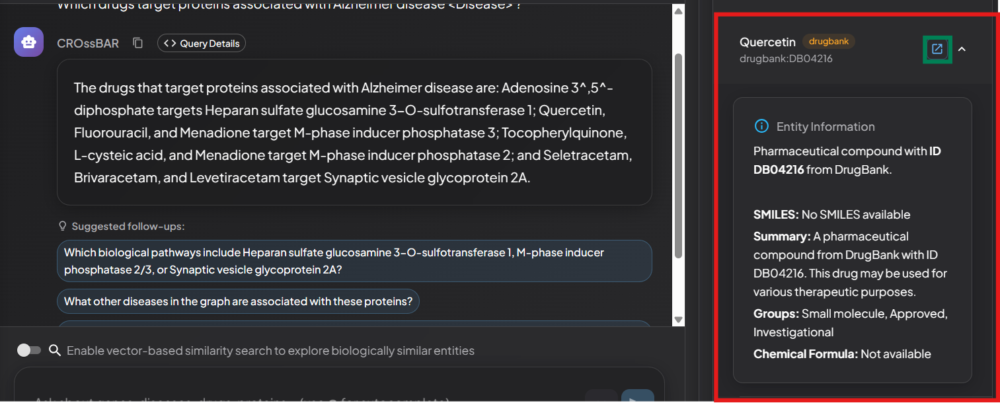 

In the bottom-right area of the interface, you can find the **Structured Query Results** panel that provides a direct view of the raw data retrieved from the graph database.

 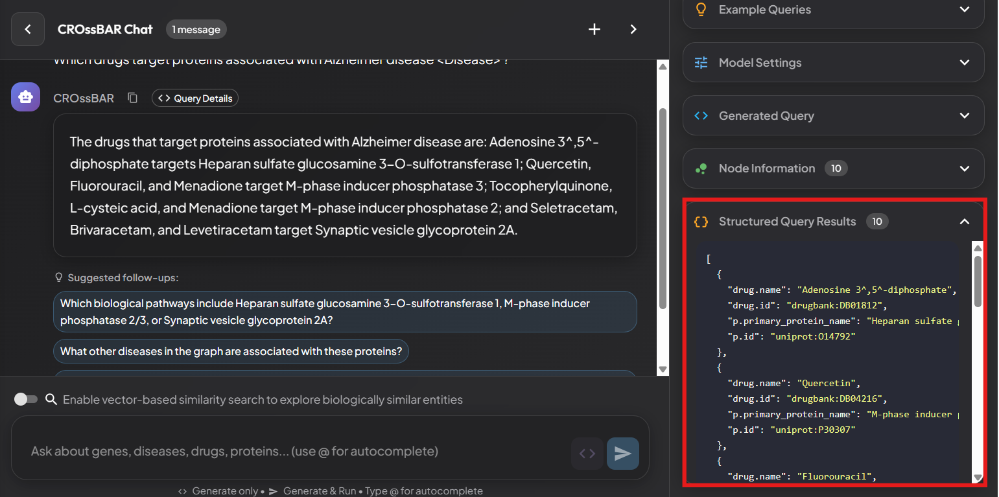 

To facilitate deeper exploration and continuous discovery, CROssBAR-LLM provide 3 follow-up question recommendations based on your question and the retrieved results. You can click these suggestions to explore related entities and relationships in more depth.

 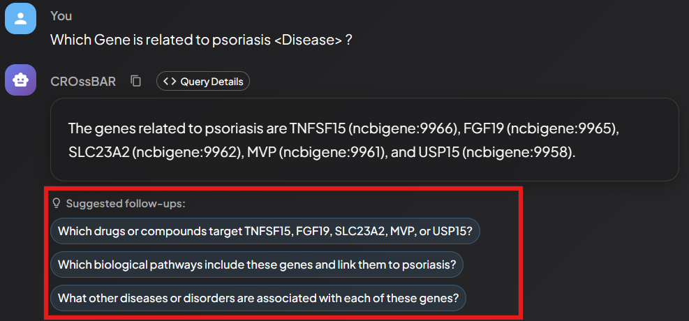 

By design, CROssBAR-LLM keeps a short-term memory of your active session. This allows you to ask follow-up questions that refer to your previous queries and continue the conversation naturally.

 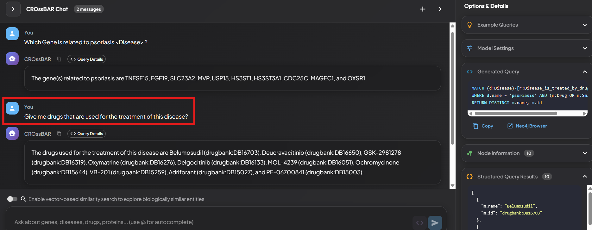 

During multi-turn conversations, interface allows you to revisit and access the results of your previous interactions.

By clicking the **<> Query Details** button located just above the answer section of any previous result, you can revert the sidebar panels to display the data for that specific turn. When active, a blue status bar will appear in the sidebar indicating that you are currently **"Viewing query from message #N"**.

 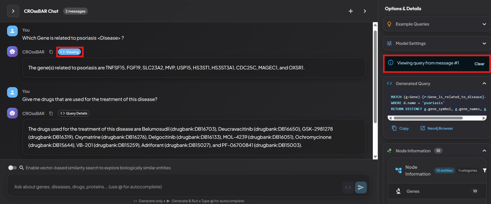 

# Vector Search

Beyond traditional graph exploration, CROssBAR-LLM also offers vector-based similarity search to help you identify semantically related entities that may lack a direct connection in the KG.

This is enabled by generating and storing embeddings for key biological entities, such as proteins, drugs, and Gene Ontology terms, as node properties in the graph. These embeddings are indexed using Neo4j’s native [vector index](https://neo4j.com/developer/genai-ecosystem/vector-search/), allowing efficient and powerful semantic similarity searches.

By toggling the **Enable vector-based similarity search to explore biologically similar entities** switch located just above the *query input field*, you can activate the vector search feature. Once activated, vector search mode becomes available, and **all previously described features continue to work in the same way**.

 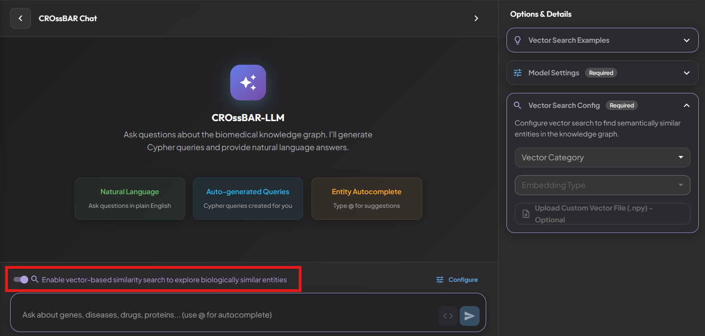 

The Vector Search feature provides two powerful ways to explore biological similarities. By selecting a **Vector Category** and an **Embedding Type**, you can search for semantically similar entities within the KG (for example, listing the most similar entities to a given node or calculating the similarity score between two entities). 

Alternatively, you can upload custom external embeddings of a biological entity to identify analogous entities in the KG. Custom embeddings must be generated for the same entity type using one of the supported embedding methods; otherwise, they will not be compatible. External embeddings must be uploaded in **.npy** format using the **Upload Custom Vector File (.npy)** button.

You can try both options directly from the **Vector Search Examples** panel. This section provides ready-to-use examples for in-graph similarity search as well as examples that use preloaded external embeddings, allowing you to explore both approaches easily.

Before you begin querying, you must configure your LLM preferences and vector search settings in the **Model Settings** and **Vector Search Config** dropdown.

To configure vector search, open the **Vector Search Config** dropdown on the right side of the interface and set the following parameters:
- **Vector Category:** Select the entity type (such as Drug, Phenotype, or Protein) that you want to search within using vector similarity.
- **Embedding Type:** Choose the embedding model used to generate the vector index for the selected entity type (for example, ESM2 or ProtT5 for proteins).
- **Upload Custom Vector File (Optional):** Use the Upload Custom Vector File (.npy) button to provide your own external embedding file for comparison against the KG.

 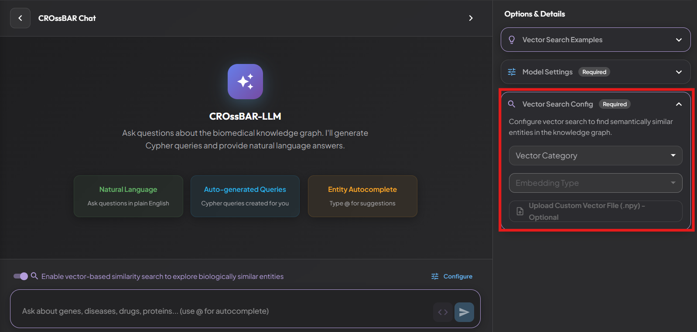 

# Usage Tips

- Smaller models are more prone to generating hallucinated queries. For reliable results, we recommend using SOTA LLMs.

- The Cypher queries generated by the LLMs can also be used in the Neo4j Browser for interactive visualization and further analysis.

- When formulating questions, including the node type after the biological entity (e.g., ALX4 \<Gene> or diabetes mellitus \<Disease>) improves the LLM's ability to generate correct Cypher queries.

- Queries using database identifiers yield more precise results. Identifiers follow the compact resource identifier (CURIE) format (e.g., uniprot:Q9H161) from Bioregistry. Ensure your queries use this format. Below are examples for each node type.

- If using biological entity names instead of identifiers, preferred way is to use the autocomplete feature. This ensures you select the exact equivalent from the KG, improving query accuracy.

- If you plan to use the vector-based similarity search with your own embeddings, you must first generate embeddings compatible with one of the vector indexes in the KG for the relevant biological entity. The embeddings should be saved in .npy format and uploaded before performing the search. Note that each uploaded file must contain embeddings for a single entity only; similarity searches for multiple entities are not supported.

# Node Types and CURIE Format

| Node Type | CURIE |
|---|---|
| Protein | uniprot:Q9H161 |
| Gene | ncbigene:60529 |
| OrganismTaxon | ncbitaxon:9606 |
| ProteinDomain | interpro:IPR000001 |
| Drug | drugbank:DB00821 |
| Compound | chembl:CHEMBL6228 |
| GOTerm (BiologicalProcess, MolecularFunction, CellularComponent) | go:0016072 |
| Disease | mondo:0054666 |
| Phenotype | hp:0000012 |
| SideEffect | meddra:10073487 |
| EcNumber | eccode:1.1.1.- |
